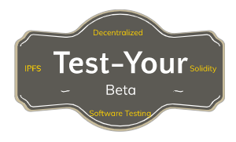
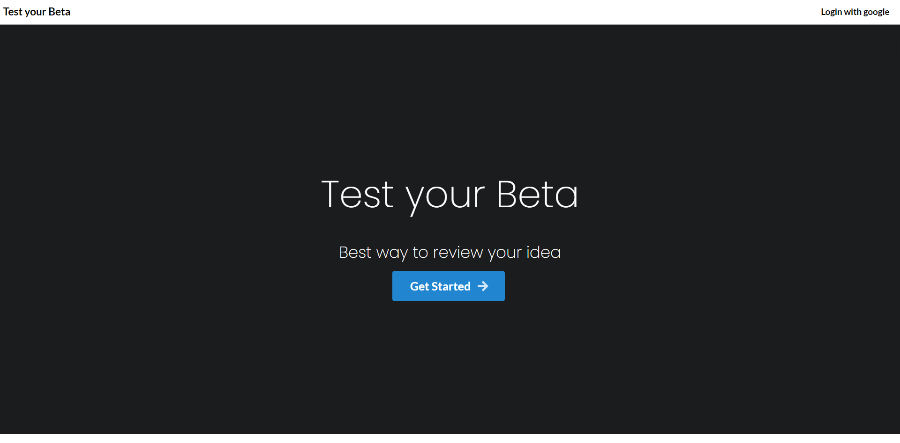
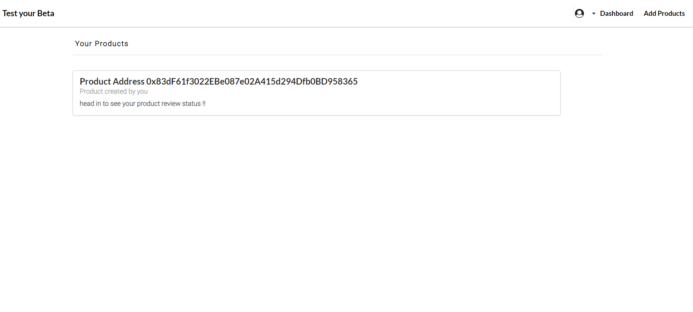
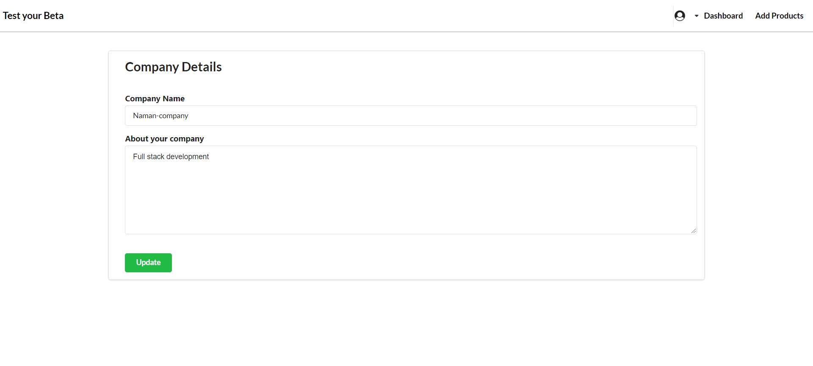
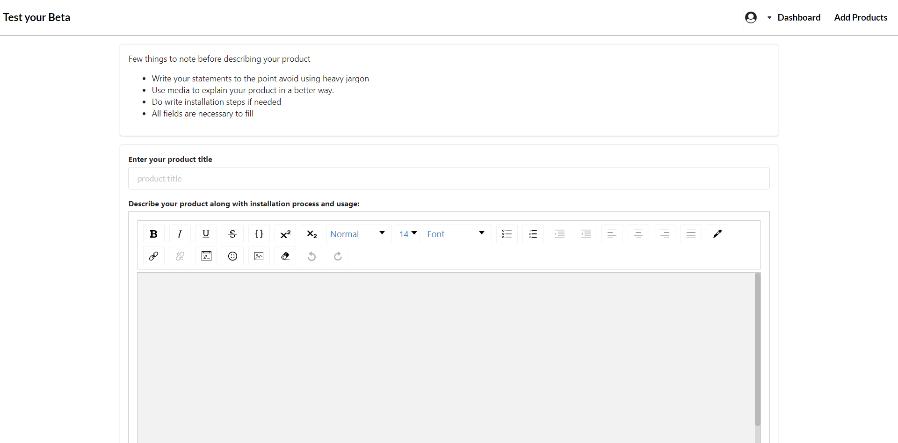
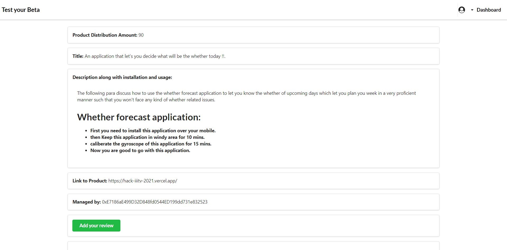
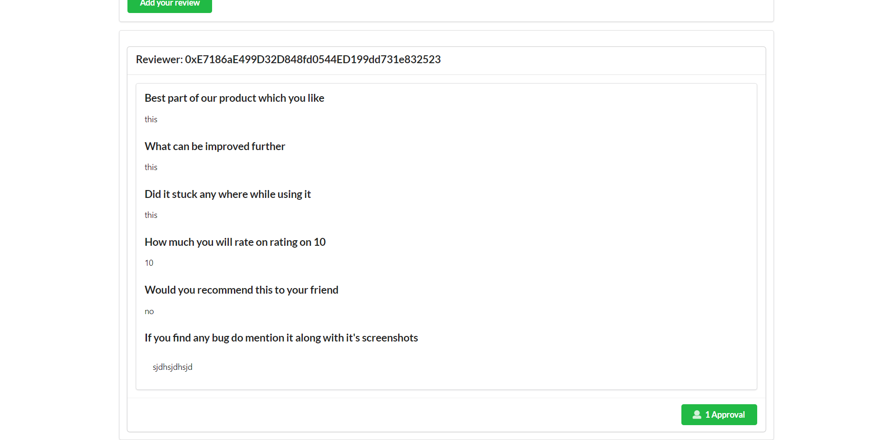
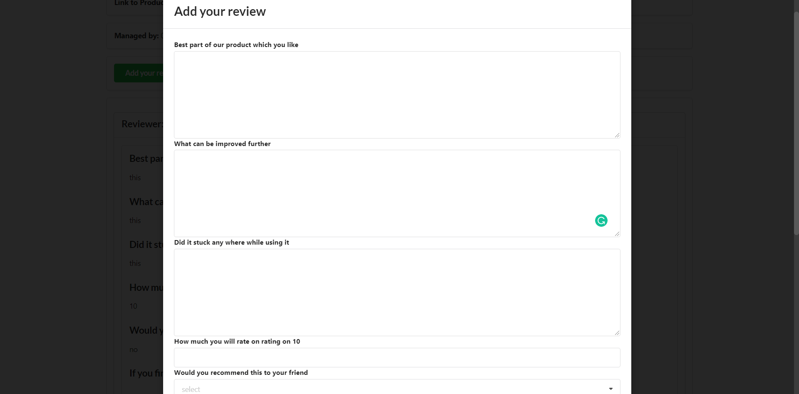

</img>

# Index
- Problem Statement
- Solution Proposed
- How it Works
- Challenges we faced
- Running Locally
- Demonstration
- Glimpse

## Problem Statement
It is often the case that developers test their products amongst the team or among a limited users and miss out on the various perspectives and feedback they could get from a large audience. Even though the product's features, ui, performance may seem fine for the developers and alpha testers, but the actual target users may have a negative and constructive feedback. In these cases, the company's effort and capital goes wasted

## Solution Proposed
So, our hack basically solves this issue by bringing all the different categories of audience on our portal and allowing the companies to test their products on the audience and gain valuable feedback from them in return of rewards.

## How it Works
- On signing in to the application, it will ask to select a role - either User or Company. Upon role selection, it will ask for some basic details from Users as well as Company.
- On successful signup, users can see the product posting, test them and give their feedback and can gain rewards if the company thinks it's a valuable feedback. Users can also see the total budget allocated by the company for rewards on feedback and can also track how much of the budget has been already rewarded to other users.
- Companies can view their previous product posts on their dashboard and can also add a product. While adding they can enter their budget amount to be distributed for rewards and other necessary details.
- Also this application can be used by startups looking for seed funding as this application provokes untempered transparent reviews by customers. The application in itself is decentralized as there is no sole owner of this platform which brings the factor of self ownership and integrity into play. The reward factor is the level1 security induced by smart contract as first the company adds the budget for reviews and the money get deposited to the smart contracts so as to encourage companies to incentivise reviewers

## Challenges we faced
- **Distribution of Budget:**  So, one of the challenges was the distribution of the budget allocated by the company for rewarding the reviews. It would have been really hectic for a company to go on sending money for each review. So, what we did was we developed an algorithm which takes in the ratings given to each review and divides the budget accordingly. So, the company only needs to rate each review and just click one button to send money which will automatically divide the budget and send it to the reviewers.

- **Proper Use of IPFS:** We wanted the reviews data to be secured and unchangeable. So, IPFS was perfect for data integrity. So, we stored all the reviews in IPFS which only has add and read operations.The data in IPFS is immutable and the data we wanted to store in it was supposed to be updated in real time. So, we stored the mutable data inside a smart contract so we could update it in real time. Also, storing data in smart contracts is costly, so we decided to store some data in Firebase.

- **Celo Extension Wallet:** We thought about using Celo exchange for rewarding reviewers and deploying solidity smart contracts over the alfajores testnet. But, the support of their libraries and celo extension wallet was limited. So, to get the full flexibility for smart contract we switched over to etherium and deployed our contract over rinkeby testnet.

- **Choosing the Best Idea**: We gathered many ideas like Ride Sharing application where we felt adding a block chain to it would be kind of over engineering it. Another one like NFT Selling Platform was the one where there were some already existing platforms which are already doing great. A mentor-mentee app where mentor gets paid through a smart contract after mentee gets an internship but it had some flaws like the no one can verify if the mentee really has bagged an internship or not.

## Running Locally
- Go to Code on Github Desktop of this repository and copy its http link from there.
- Now Open your terminal.
- Navigate to any directory preferred by you through using cd command.
- Clone project there by git clone <url copied>
Navigate to Frontend by cd HackIIITV2021 and type `npm install` to install all packages.
- Type `npm run start` to start the server.

## Demonstration
<a href="https://www.youtube.com/watch?v=adbtcexU0IY">Link to Youtube Video</a>

## Glimpse
<kbd>
</img>
</kbd>
<kbd>
</img>
</kbd>
<kbd>
</img>
</kbd>
<kbd>
</img>
</kbd>
<kbd>
</img>
</kbd>
<kbd>
</img>
</kbd>
<kbd>
</img>
</kbd>

